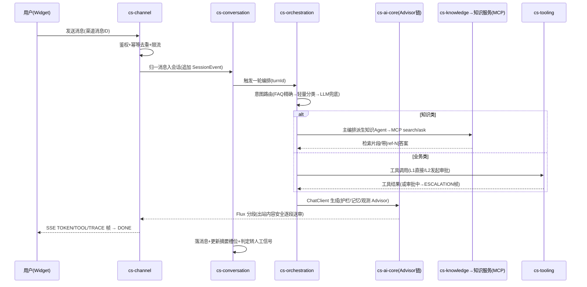

# 01 · 总体架构与关键决策

> 版本 v1.0.0 ｜ 2026-09-20 ｜ 初版（基于 2026-09 三路 Web 调研：Spring AI 2.0 官方实践 / 2026 客服 Agent 平台参考架构 / 评测可观测安全合规落地）

## 1. 产品定位与范围

CSCA 是**企业级**智能客服助手与多 Agent 协同服务平台，一体两面：

1. **智能客服助手（对终端用户）**：多渠道接入（Web Widget / OpenAPI，预留 IM），以知识问答（对接既有知识服务）、业务办理（工具执行）、多轮澄清、人工协同为核心能力，交付可度量（Resolution/CSAT）的服务质量。
2. **多 Agent 协同服务平台（对企业）**：Agent 定义/注册/版本化、编排引擎、工具与 MCP 治理、A2A 双向互操作（既把平台 Agent 能力暴露给企业其他系统，也消费远端 Agent），配套评测与质量运营闭环。

**范围内**：会话管理、编排引擎、知识集成、工具治理、人机协同、评测运营、安全合规、管理后台。
**范围外（本期）**：语音/视频渠道、模型训练与微调、知识库自身的 ETL（归知识服务）、呼叫中心坐席语音。范围外项通过协议边界（HTTP/MCP/A2A）预留扩展。

## 2. 质量目标（NFR）

| 维度 | 目标 | 度量方式 |
|---|---|---|
| 性能 | 首 token ≤ 2s（P95）、完整应答 ≤ 15s（P95，含 1 次工具往返）；语义缓存命中率 ≥ 20% | OTel 指标 `cs_chat_first_token_seconds` / `cs_chat_total_seconds` |
| 可用性 | 单部署 99.9% 月度；模型供应商故障时降级可用（兜底话术+转人工）不可用时长 ≤ 5min | 健康检查 + 熔断器指标 |
| 安全 | L2 工具 100% 人工审批；内容安全双向送审覆盖 100% 会话；审计日志不可篡改 | 护栏拦截计数 / 审计链校验 |
| 质量 | golden set 回归通过率 ≥ 95%；在线 judge 低分率（1 档占比）周滚动 ≤ 5% | cs-eval + Langfuse Scores |
| 可维护 | ArchUnit 违规 = 0；核心域单测覆盖率 ≥ 80%；文档-代码同步率 100%（AGENTS.md 纪律） | CI 门禁 |
| 成本 | 每 Contained Resolution 模型成本可核算并按租户摊分；小模型分流率 ≥ 60% | token 计量按 tier/租户聚合 |

## 3. 总体架构

```
┌─ 渠道接入层 cs-channel ───────────────────────────────────────────────┐
│  Web Widget(SSE/REST) │ OpenAPI(服务集成) │ 预留: 钉钉/企业微信/邮件  │
│  职责: 鉴权 · 渠道消息幂等去重 · 格式归一 · 租户/用户限流 · SSE 帧协议│
└──────────────┬────────────────────────────────────────────────────────┘
               ↓ 统一消息信封
┌─ 会话与上下文 cs-conversation ─────┐    ┌─ 人机协同 cs-collaboration ─┐
│ 会话状态机 · 事件溯源 · 上下文组装 │ ←→ │ 转人工决策 · 技能组队列/分配│
│ (窗口+滚动摘要+槽位) · 澄清管理    │    │ 坐席工作台(WS) · copilot    │
└──────────────┬─────────────────────┘    │ L2 审批卡片 · wrap-up 口径  │
               ↓                          └─────────────────────────────┘
┌─ 编排引擎 cs-orchestration ───────────────────────────────────────────┐
│ 意图路由(规则+FAQ精确 → 轻量分类器 → LLM兜底) · 主编排 Agent          │
│ 专职 Agent 派生(知识/业务办理) · Agent 注册表/版本 · A2A server/client│
└───────────┬──────────────────────────┬─────────────────────────┬──────┘
            ↓                          ↓                         ↓
┌─ 知识集成 cs-knowledge ─┐ ┌─ 工具中心 cs-tooling ─┐ ┌─ AI 内核 cs-ai-core ─┐
│ FAQ 直答(Milvus)        │ │ 工具注册表 L0/L1/L2   │ │ 模型分级路由         │
│ 知识服务 MCP(主通道)    │ │ MCP client 治理       │ │ Advisor 护栏链       │
│ 知识服务 A2A(备用通道)  │ │ 审批·配额·熔断·审计   │ │ Prompt 管理·语义缓存 │
└────────┬────────────────┘ └──────────┬────────────┘ └───────────┬──────────┘
         ↓  JWT (Casdoor)              ↓                          ↓
   ┌─────────────────┐      ┌───────────────────┐     ┌─────────────────────┐
   │ 知识服务(已上线)│      │ 业务系统(初期Mock)│     │ 模型: GLM/DeepSeek/ │
   │ MCP: POST /mcp  │      │ 订单/工单/退款    │     │ Qwen(OpenAI 兼容)   │
   │ A2A: POST /a2a  │      │ 后期经 MCP 接入   │     └─────────────────────┘
   └─────────────────┘      └───────────────────┘
横切: cs-commons 契约 · cs-infra 存储适配(PG/Redis Stack/ES/Milvus/Neo4j)
      安全合规(分层护栏/内容安全/PII/多租户) · 可观测(OTel→Jaeger+Langfuse·审计)
      评测运营(golden set/judge/canary/badcase) · cs-admin 管理后台 · cs-eval 评测执行
```

### 3.1 核心时序：用户消息主链路



### 3.2 核心时序：转人工（详见《07-HITL》）

触发（显式请求/情绪/低置信/重复未解决/L2 审批）→ 生成会话摘要（warm handoff 载荷）→ 技能组排队 → 分配坐席（并发 3~5，首响 SLA 40s）→ 坐席接管（WebSocket，历史+摘要+证据回填）→ 处置 → wrap-up 结构化回流评测口径。

## 4. 技术栈清单（版本钉板）

| 层 | 选型 | 版本基线 | 说明 |
|---|---|---|---|
| 语言/运行时 | JDK | 25 LTS | 虚拟线程承载阻塞式 LLM IO（JEP 491 后无 synchronized pinning） |
| 框架 | Spring Boot / Framework | 4.1.x / 7.x | Jackson 3、JSpecify 空安全 |
| AI 框架 | Spring AI（BOM） | 2.0.x（当前 2.0.1） | ChatClient/Advisor/MCP/观测；`spring-ai-bom` 钉版 |
| 模块化 | Spring Modulith（事件注册表） | 2.1.x | 仅用事件发布注册表；模块边界校验用 ArchUnit（见 D-02） |
| 安全 | Spring Security（OAuth2 Resource Server） | 随 Boot | Casdoor 签发 JWT，与知识服务同源身份体系 |
| 模型 | GLM / DeepSeek / Qwen | OpenAI 兼容端点 | 与知识服务同源策略：GLM 主力、DeepSeek 回退、Qwen flash 辅助族 |
| 存储 | PostgreSQL / Redis Stack / ES / Milvus / Neo4j | ECS 已备 | 分工见《12-数据与存储》 |
| 可观测 | Micrometer + OTel（OTLP）→ Jaeger + Langfuse 自托管 | semconv Development | 部署形态见《10-可观测》 |
| 评测 | promptfoo（Node 24）+ Python 侧车（Ragas/DeepEval，FastAPI） | — | CI 门禁 + 调优期深度指标 |
| 构建/测试 | Maven 多模块 · Testcontainers 2.x · ArchUnit | — | 集成测试起真实 PG/Redis/ES/Milvus/Neo4j |

## 5. 关键决策记录（ADR）

状态：`已定案`（用户确认）/ `已决策`（本文档定案，可经回写流程推翻）。

| 编号 | 决策 | 理由与替代方案 | 状态 |
|---|---|---|---|
| D-01 | 技术栈 = Spring AI 2.0.x + Boot 4.1 + SF7 + JDK 25 | 2026-09 三路调研定案；替代 Python+LangGraph 因团队技能与国内企业市场现实被否 | 已定案 |
| D-02 | 部署形态 = 模块化单体（Maven 多模块 + 单部署单元） | 0→1 单 ECS 资源下微服务纯增运维成本；模块边界以 ArchUnit + api 包强制，保留按模块拆分微服务的演进路径（模块即未来服务边界） | 已决策 |
| D-03 | 模型接入 = OpenAI 兼容多厂商 + 自研 `RoutingChatModel` 分级路由 | Spring AI 无官方 fallback/路由抽象（已核验）；厂商全 OpenAI 兼容使接入语言中立 | 已决策 |
| D-04 | 编排 = 自研轻量编排引擎，不引入 LangGraph4j / 硬依赖 spring-ai-session | LangGraph4j 单人维护（bus factor）；spring-ai-session 0.8.0 pre-1.0；客服域编排模式收敛（路由/链/并行/生成-校验），Anthropic《Building Effective Agents》五模式够用 | 已决策 |
| D-05 | 知识集成 = MCP 工具化为主通道，A2A 为备用/互操作通道 | Agentic retrieval（编排层决定何时检索）为 2025-2026 共识；MCP 面向 Agent→工具，A2A 面向 Agent↔Agent（跨系统互操作） | 已决策 |
| D-06 | 对外互操作 = A2A v1.0；spike `spring-ai-a2a` 社区模块，不满足则按知识服务已验证的自研协议层形态落地 | 社区模块孵化中（47★，无正式 release 包）；知识服务已有成熟自研 A2A 协议层先例（AgentCard + JSON-RPC SendMessage + JWT）；**姊妹项目已实证 a2a-java SDK 桥接因 Quarkus/CDI 绑定不适配 Spring 栈（spike 判负，坑#02），自研预案权重上调** | 已决策 |
| D-07 | 流式 = SSE（WebMVC + 虚拟线程，Controller 返回 Flux 适配）；坐席工作台用 WebSocket（双向） | SSE 是 LLM 流式事实标准；仅坐席台需要双向实时 | 已决策 |
| D-08 | 可观测 = OTel 语义约定 + 双后端（Jaeger 工程排障 / Langfuse 质量运营），Langfuse 自托管随平台新增部署 | Langfuse 承载 prompt 管理/评测/标注闭环；复用 Jaeger+Prometheus+Grafana 既有监控形态（与知识服务运维同构） | 已决策 |
| D-09 | 评测 = promptfoo 为主回归（HTTP provider，语言中立）+ Python 侧车（Ragas/DeepEval）仅调优期 | 避免 Java 团队双 CI 体系；深度 RAG 指标按需启用侧车 | 已决策 |
| D-10 | 护栏 = Advisor 链内建分层护栏 + 阿里云内容安全流式分段送审（入站 query 审核 / 出站 response 审核） | 分层防御对标 OWASP LLM 2025 与分层护栏共识（输入→检索→生成→工具→输出） | 已决策 |
| D-11 | 存储 = PG 业务主库 / Redis Stack 热态+语义缓存 / ES 检索 / Milvus 平台自有向量（FAQ、意图 few-shot）/ Neo4j 图谱（M2+ 缺口聚类与排查树） | 五存储各司其职，均有 ECS 现存实例 | 已决策 |
| D-12 | 认证 = Casdoor OAuth2/OIDC（JWT），服务间 MCP/A2A 调用同源 JWT + scope 治理（fail-closed 三层，同知识服务纪律） | 与既有平台统一身份体系；复用已验证的 guard 模式 | 已决策 |
| D-13 | 多租户 = 共享库 + `tenant_id` 服务端强制过滤 + PG RLS 兜底；向量/ES 查询过滤由服务端注入 | 业务线少而重，index-per-tenant 过度设计；查询期强制过滤为多租户 RAG 主流模式 | 已决策 |
| D-14 | HITL = 平台内置坐席域（技能组队列/分配/工作台/copilot），文字坐席并发 3~5（默认 4，可配） | 行业典型值；外呼/呼叫中心范围外 | 已决策 |
| D-15 | Prompt 管理 = Langfuse 托管（label 灰度 production/canary）+ 本地缓存 + 代码内兜底模板；canary 按会话切流 10% | prompt 当代码管理（不可变版本+评测绑定）；rainbow 升级不打断进行中会话 | 已决策 |
| D-16 | 平台自身 MCP server 暴露（把平台工具暴露给第三方 Host）延至 M3 决策 | 本期 MCP 以 client 角色为主（消费知识服务工具）；对外能力走 A2A | 已决策 |
| D-17 | 高危工具 L2 = 100% 人工审批（完整参数载荷展示），配 per-session/per-tenant 配额与金额阈值 | 过度代理（LLM06）是客服最致命风险；审批必须「批的是完整 payload」 | 已决策 |
| D-18 | 合规 = 按企业内部使用路线（免大模型备案）设计，但合规模块（AI 标识/违规计数/题库门禁/审计留存）按公众服务标准建设，预留对外开关 | GB/T 45654-2025 量化指标作为上线门禁照建；内部使用可免备案但监管趋势要求同水位 | 已决策 |

## 6. ADR 生命周期与决策纪律

- **状态机**：`提案 → 已定案（用户确认）/ 已决策（本文档定案，可经回写流程推翻）→ 已否决（必须附重估触发条件，如「多节点部署时重估 K8s」）`。
- **定案记录格式**：决策详表（选项/形态/依据，推荐项加粗置首）落对应里程碑卷 §5，底部 `> 定案记录(日期 拍板人): Dx=…`；本文 ADR 表只维护结论行。
- **spike 纪律**：技术验证类决策先 spike、后拍板；判负必须留档（判据、失败证据、回落路径），提交信息与 M 卷决策点同步（先例：姊妹项目 a2a-java SDK spike 判负回落自研）。
- 推进纪律总纲见 `docs/project-progress/PROJECT-PROGRESS.md` §3。

## 7. 已核验事实与待源码核验清单

按 AGENTS.md 落码纪律（先核验再落码），以下 Spring AI 2.0 事实**已经官方文档核验**，可直接引用：

- Advisor 接口族（`CallAdvisor`/`StreamAdvisor`，order 小者先执行、栈式语义）；内置 `MessageChatMemoryAdvisor`（默认 `HIGHEST_PRECEDENCE+200`）、`ToolCallingAdvisor`（+300）、`RetrievalAugmentationAdvisor`、`StructuredOutputValidationAdvisor`（JSON Schema DRAFT_2020_12 校验、默认重试 3 次、**不支持流式**）。
- ChatMemory 策略/存储分离；官方 JDBC 仓库**静默丢弃 tool-call 消息**（本平台因此自研事件溯源存储，见 D-04/《03》）。
- 工具调用循环 2.0 移入 Advisor 链；工具上限默认 `maxCallsPerTool=40 / maxTotalToolCalls=150`；`ToolContext` 传租户等模型外上下文；`ToolSearchToolCallingAdvisor` 官方基准节省 34–64% token（≥10 工具时启用）。
- MCP：客户端 starter `spring-ai-starter-mcp-client-webflux`（生产推荐）；连接配置 `spring.ai.mcp.client.streamable-http.connections.<name>.url/endpoint`；**服务端默认协议是 SSE**，暴露时须显式 `protocol: STREAMABLE`（知识服务已踩过此坑）。
- MCP security 社区模块为 WIP（WebMVC only），生产采用自建 Spring Security 过滤链 + JWT（与 D-12 一致）。
- `spring-ai-starter-mcp-client-test` **在 2.0 不存在**（调研确认），MCP 测试走 WireMock/真实容器。
- 观测：ChatClient/ChatModel/Tool/VectorStore/Advisor 均有内建 observation；prompt/completion 明文默认关闭，需显式开启 + 自定义 `ObservationFilter`（详见《10》）。
- 向量库 2.0 `initialize-schema` 默认 **false**；四家封装层均不暴露混合检索，混合检索需 `getNativeClient()`。
- 重试：`spring-ai-retry` 基于 SF7 `org.springframework.core.retry.RetryTemplate`，5xx/IO 指数退避、4xx 不重试；无官方限流/降级抽象 → 自研（D-03）。

**落码前必须源码核验**（文档不视为最终依据）：

| # | 待核验点 | 位置 |
|---|---|---|
| V-01 | MCP client streamable-http 连接注入 `Authorization` 头的配置形态 | MCP Java SDK 2.0.x / Spring AI 2.0.1 autoconfigure 源码 |
| V-02 | `spring.ai.tools.limits.*` 配置键实际名称与默认值 | spring-ai-tools 模块 |
| V-03 | MVC 下 Controller 返回 `Flux` 的 SSE 适配行为与心跳控制 | Spring Framework 7 |
| V-04 | `spring-ai-a2a` server autoconfigure 实际能力（M2 spike） | spring-ai-community 仓库（注意：其底层 a2a-java SDK 有 Spring 适配判负先例，坑#02） |
| V-05 | Langfuse OTLP 集成细节（`ObservationFilter` 注入 `gen_ai.prompt/completion`、`langfuse.*` 属性） | Langfuse 官方 Spring AI 指南 + 样例工程 |
| V-06 | Milvus starter 元数据过滤表达式对 tenant_id 过滤的下推行为 | spring-ai-vector-store-milvus |

## 8. 演进原则

1. **协议化解耦**：模型（OpenAI 兼容）、工具（MCP）、Agent 互操作（A2A）、观测（OTLP）全部走开放协议，任何一层替换为异构实现（如 Python 组件）都是局部手术。
2. **从最简模式开始**（Anthropic 忠告）：编排从 Routing 起步，仅当可证明收益时引入 Orchestrator-Workers 等复杂度；多 Agent token 成本约为普通对话 15 倍，专职 Agent 派生必须节制。
3. **模块即未来服务**：Maven 模块 = 限界上下文 = 潜在拆分单元；跨模块只走 api 包与领域事件。
4. **一切可度量**：每个能力上线即有指标与评测挂钩（deflection 不是 resolution，口径见《09》）。
