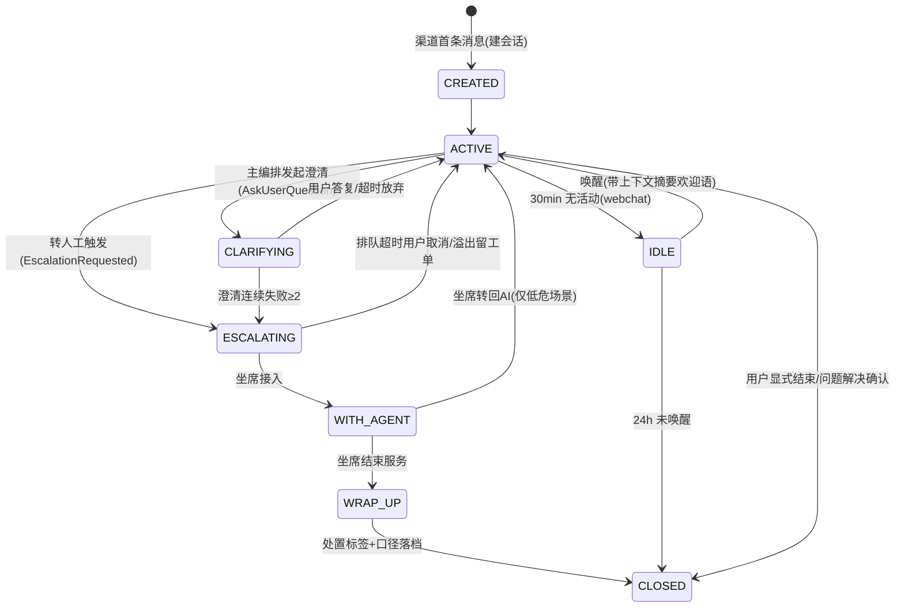

# 03 · 会话与上下文工程

> 最后更新:2026-09-20 · v1.1.0(终审：Advisor 装配钉序纪律，防自动注册顺序陷阱) · v1.0.0(初版) ｜ 依赖《01》D-04/D-07/D-13，《02》会话上下文

## 1. 领域模型

```
Session(聚合根) 1 ── n Turn 1 ── n Message
Session 1 ── n SessionEvent（事件溯源，含非消息事件：状态迁移/工具/审批/送审）
Session 1 ── 1 ConversationSummary（滚动摘要，派生）  1 ── n Slot（槽位，派生）
```

| 实体 | 关键字段 | 说明 |
|---|---|---|
| `cs_session` | id, tenant_id, channel, visitor_id/user_id, state, intent_current, skill_group_id?, agent_seat_id?, created_at, last_active_at, closed_at, close_reason, csat_score?, resolution_type? | 会话主档；`resolution_type ∈ {CONTAINED, VERIFIED, NONE}`（口径见《09》§1） |
| `cs_turn` | id, session_id, seq, intent, route_decision, model_tier, tokens_in/out, latency_ms, state | 一轮编排的执行单元与计量单元 |
| `cs_message` | id, session_id, turn_id, seq, role(USER/AI/AGENT/SYSTEM), content_type(TEXT/CARD/APPROVAL), content, content_redacted, channel_msg_id, meta(jsonb) | `channel_msg_id` 参与`(tenant_id, channel, channel_msg_id)`唯一键（幂等） |
| `cs_session_event` | id, session_id, seq, event_type, payload(jsonb), trace_id, occurred_at | 事件溯源主表；上下文重建与审计的事实来源 |
| `cs_conversation_summary` | session_id, summary, covering_turn_seq, updated_at | 滚动摘要（覆盖到第 N 轮） |
| `cs_slot` | session_id, key, value, source, updated_at | 关键槽位：订单号/商品/身份核验态/情绪值等 |

## 2. 会话状态机



- 迁移只经 `cs_session_event` 记录（`SESSION_STATE_CHANGED`），状态写入与事件同事务。
- 所有终态迁移触发 `EscalationResolved`（若有坐席段）或直接进入口径判定（《09》§1）。

## 3. 上下文组装（Context Engineering）

**目标**：每轮给模型的上下文 = 系统提示（租户域）+ 长期背景（滚动摘要 + 槽位）+ 近期记忆（窗口内完整轮次）+ 本轮输入；总预算 ≤ 8K token（T1 模型），超限先压窗口再压摘要。

### 3.1 三层记忆模型

| 层 | 内容 | 存储 | 生命周期 |
|---|---|---|---|
| 热记忆 | 最近 20 轮完整消息（含 tool 调用/结果消息） | PG `cs_session_event` + Redis 读缓存 | 会话存续 |
| 温记忆 | 滚动摘要（覆盖窗口之前的全部历史，turn-aware：按轮边界压缩） | `cs_conversation_summary` | 会话存续 |
| 冷记忆 | 全量事件（可回放重建任意时点上下文） | PG `cs_session_event` | 180d（留存策略见《12》§7） |

**为什么自研而不用官方 ChatMemory JDBC 仓库**：官方 JDBC/Cassandra/Mongo 仓库会**静默丢弃 tool-call 消息**（官方文档明示），而客服编排高度依赖工具往返的上下文完整性；`spring-ai-session` 社区模块解决了该问题但为 0.8.0 pre-1.0（44★），企业采用风险评估不通过（D-04）。自研实现借鉴其设计：事件溯源 + turn-aware compaction。

### 3.2 组装算法（每轮）

```
buildContext(sessionId, turn):
  1 slots       := 全量槽位（脱敏后）
  2 summary     := 滚动摘要（若覆盖轮次 < window_start 则先压缩一轮）
  3 window      := 从 cs_session_event 取 (window_start..current] 的完整轮次（含 TOOL 消息）
  4 system      := 租户系统提示（PromptRepository，见《09》§5）+ 护栏指令（spotlighting 声明）
  5 budget      := 8K - size(system) - size(summary) - size(slots) - reserve(output)
  6 window      := 从旧到新截断至 budget（保最近，轮边界对齐）
  return [system, summary_as_system_note, ...window, current_user_message]
```

- 摘要压缩：`T0` 小模型执行，触发条件 = 窗口外新增轮次 ≥ 6 或预算超限；prompt 固化在 PromptRepository（`context.summarize`）。
- 槽位由编排引擎写入（意图/实体抽取结果），`source ∈ {AI_EXTRACTED, USER_CONFIRMED, TOOL_RESULT}`，`USER_CONFIRMED` 优先且不可被 AI 覆盖。

### 3.3 唤醒与跨轮一致性

IDLE 唤醒时插入一条 `SYSTEM` 消息：「欢迎回来 + 一句话历史摘要 + 未完结事项」，避免用户复述（对齐 warm handoff 原则）。72h 内同 visitor 同渠道优先续接 IDLE 会话而非新建。

## 4. Advisor 链（cs-ai-core 装配，跨文档权威定义）

order 小者先处理请求、后处理响应（栈式）。**本表为全平台唯一权威链序**：

| order | Advisor | 方向职责 | 实现归属 |
|---|---|---|---|
| 100 | `ObservationRootAdvisor` | 根观测 span，注入 `langfuse.user.id/session.id`、`cs.tenant/intent` 属性 | ai-core |
| 200 | `InputModerationAdvisor` | 入站内容安全（`llm_query_moderation`）+ 注入特征检测（规则+小分类器）；命中→拦截并产生 `ContentPolicyViolated` | ai-core（调 infra 内容安全客户端） |
| 300 | `PiiInboundAdvisor` | 入站 PII 识别→按策略脱敏/标注（不改变语义，供后续审计对齐） | ai-core |
| 400 | `SessionMemoryAdvisor`（自研） | §3.2 上下文组装注入；写回新消息事件 | conversation 提供，ai-core 装配 |
| 500 | `RetrievalAugmentationAdvisor`（按需） | 仅知识直答链路启用；agentic 检索链路由编排层显式调 `KnowledgePort`（不走此 Advisor，见《05》§2） | ai-core/知识 |
| 600 | `ToolCallingAdvisor` | 工具调用循环（白名单经 ToolGovernor 预过滤，见《06》§4） | Spring AI 内建 |
| 900 | `OutputModerationStreamAdvisor` | **流式**分段送审（`llm_response_moderation`，按句/固定 token 窗缓冲，「已通过前缀」才透出），命中截断+兜底话术 | ai-core |
| 950 | `PiiOutboundAdvisor` | 出站 PII 扫描（出站比入站严格：拦截而非脱敏） | ai-core |
| 990 | `StructuredOutputAdvisor` | 仅结构化任务链路（意图分类/槽位抽取）启用 `StructuredOutputValidationAdvisor`（不支持流式，走 `call()`） | Spring AI 内建 |

- **装配纪律（防顺序陷阱，终审补）**：官方 `ToolCallingAdvisor` 自动注册的默认 order 为 `HIGHEST_PRECEDENCE+300`，与上表相对整数混排会插到队首、击穿护栏链序——装配时以 `spring.ai.chat.client.tool-calling.enabled=false`（或调用侧 `AdvisorParams.toolCallingAdvisorAutoRegister(false)`）关闭自动注册，**全部 Advisor 显式构造、按上表钉序注入**；本表顺序值即装配时的唯一事实源。

注：`MessageChatMemoryAdvisor`（官方）不使用——记忆职责由自研 `SessionMemoryAdvisor` 承担（§3.1 理由）。

## 5. 幂等、去重、超时

| 问题 | 机制 |
|---|---|
| 用户重复发送/客户端重试 | `(tenant_id, channel, channel_msg_id)` DB 唯一键 + Redis `cs:idem:{tenant}:{channel}:{msgId}` 30s 前置判重（SETNX）；命中直接返回既有 turnId 的 SSE 订阅句柄 |
| Webhook 重放（IM 渠道预留） | 同上幂等键；渠道适配器负责提取稳定消息 ID |
| 轮次级幂等 | `turnId` 为幂等单元：编排重试（进程内）复用同 turnId，事件追加带 `attempt` |
| 会话超时 | webchat 30min 无活动 → IDLE（发一条可配置的告别+唤醒提示）；24h 未唤醒 → CLOSED；OpenAPI 渠道超时由调用方业务定（默认 2h） |
| 并发写保护 | 同 session 同时仅允许一个进行中的 turn：Redis `cs:lock:turn:{sessionId}`（Redisson，5s TTL，获取失败返回 `TURN_IN_PROGRESS`）——用户连发消息进入合并队列（200ms 窗口合并为一条） |

## 6. 数据落位（详见《12》）

- PG：`cs_session / cs_turn / cs_message / cs_session_event / cs_conversation_summary / cs_slot`（`cs_message`、`cs_session_event` 按月分区）。
- Redis：`cs:session:state:{id}`（状态热缓存，Hash，TTL 25h 滑动）、`cs:idem:*`、`cs:lock:turn:*`、SSE 补发 ring buffer `cs:sse:buffer:{sessionTurnId}`（List，容量 256，TTL 5min）。
- ES：`cs_session_search`（会话全文检索，服务坐席搜索与缺口挖掘，非主存储）。

## 7. 修订注记

- v1.0.0（2026-09-20）：初版。
